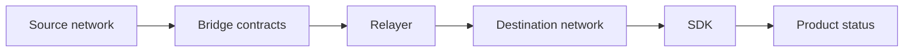

  

# Token bridge and SDK

Moving value between networks forces several systems to agree: contracts, relayers, confirmations, product state, and the application that has to explain progress to a user. This work focused on making those boundaries explicit.

[Discuss a similar system](mailto:ju@jomena.group?subject=Discuss%20Token%20bridge%20and%20SDK) | [Book a technical call](mailto:ju@jomena.group?subject=Book%20a%20technical%20call%20about%20Token%20bridge%20and%20SDK)

## The engineering problem

A bridge can be technically correct and still be operationally opaque. Users and operators need to know which step is pending, what is final, and how to recover when one side completes before the other.

## What the system covers

- Cross-network transfer workflows
- Contract and relayer integration
- SDK surfaces for product teams
- Deployment and verification tooling
- Status, retry, and reconciliation paths

## System shape

## Build notes

- Model finality as a sequence, not a boolean.
- Give every transfer a traceable identity across systems.
- Make retry behaviour safe before adding convenience abstractions.

Built under the Aryze umbrella. The underlying source and company IP remain private and owned by Aryze. Delivery involved people across engineering, product, operations, compliance, and design. Open-source foundations retain their original attribution and licences.

## Talk through a similar problem

If you are trying to build, untangle, or ship a system in this area, [send me a note](mailto:ju@jomena.group?subject=I%20need%20help%20with%20Token%20bridge%20and%20SDK). If the problem needs a deeper technical conversation, [book a call by email](mailto:ju@jomena.group?subject=Book%20a%20technical%20call%20about%20Token%20bridge%20and%20SDK).
