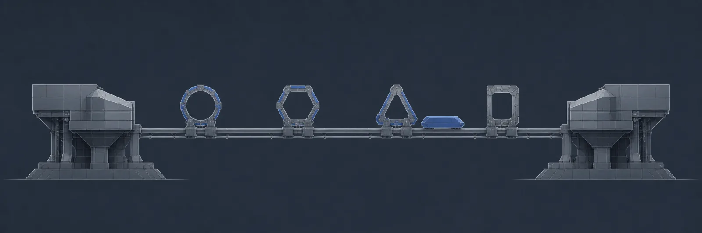
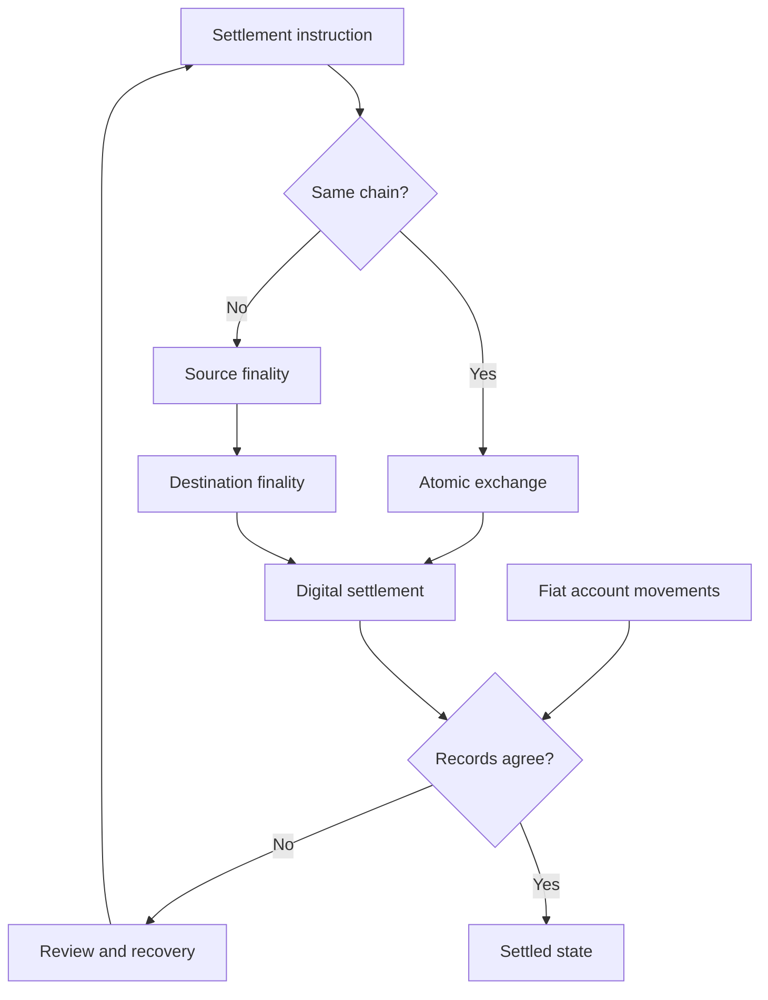

[← All systems](https://github.com/J0UH) · [Stablecoin and programmable asset infrastructure](https://github.com/J0UH/stablecoin-infrastructure)

  

# Always-on blockchain settlement

Digital value can move and settle around the clock, even when the banking world on either side still follows cut-offs, account structures, and regional operating hours. The work connects those worlds through same-chain settlement, cross-chain routes, atomic exchange, and clear reconciliation back to fiat accounts.

## The engineering problem

A settlement route can be technically correct and still be operationally opaque. Users and operators need to know which leg is pending, what is final, how the digital and fiat records relate, and how to recover when one side completes before the other.

## How it works

A signed settlement instruction defines the assets, route, fees, authority, and expected outcome. The same control spine can support a same-chain transfer, atomic exchange, cross-chain movement, issuance, or a fiat on-ramp, while each leg keeps its own evidence and finality.

## What the system covers

- Same-chain and cross-chain settlement
- Atomic asset and foreign-exchange flows
- Twenty-four-seven digital value movement
- Product integration surfaces
- Fiat-account and on-chain reconciliation
- Status, finality, and safe recovery paths

## System shape

## Build notes

- Give every settlement a traceable identity across digital and fiat systems.
- Model finality separately for every leg.
- Make recovery safe before making the route feel instant.

Public overview only. Source code, customer data, credentials, and private operating details are not included.

## Talk through a similar problem

Working on something similar? [Tell me about it](mailto:ju@jomena.group?subject=Always-on%20blockchain%20settlement).
